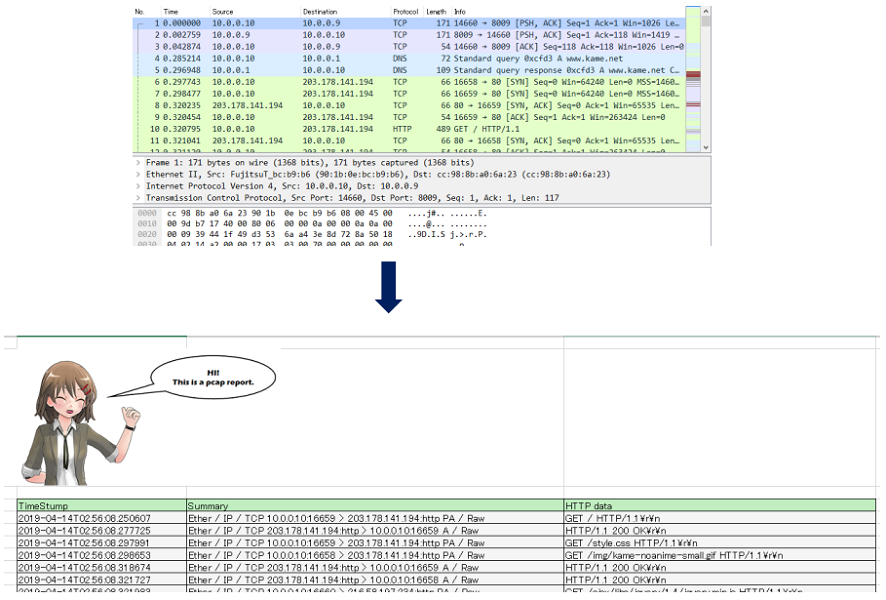

# scapy_to_openpyx_sample

I'm studying Scapy and openpyxl. :-)

This sample analyzes pcap file and pick up HTTP data. Additionally,  this sample writes results to excel file



## Key technologies

* [Scapy](https://scapy.net/)
* [openpyxl](https://openpyxl.readthedocs.io/en/stable/index.html)

## My environment

* OS: Kali Linux 2018-.4
* Python : 3.6
* Scapy : 2.4.2
* openpyxl : 2.6.2

## How to confirm this sample

### Scapy

If you want to install Scapy, you should see this webpage.

* [Download and Installation](https://scapy.readthedocs.io/en/latest/installation.html)

### pip install

```bash
pip install scapy
pip install openpyxl
pip install pillow
```

### how to confirm

This sample can work over __python3.x__.

For example,

```bash
#python scapy_to_xls_httpsampple.py [pcap filename] [port] [excel filename(option)]
python scapy_to_xls_http_sample.py sample.pcap 80 output.xlsx
```
This repository includes sample capture file(sample.pcap). In this example ,  this program makes output.xlsx. If you capture another HTTP, you can analyze your HTTP traffic.

Sample pcap is captured file I accessed kame.net

## About source code

|Filename|Description|
|:-----------|:------------|
|excel_wrapper.py|It is wrapper API of openpyxl.|
|scapy_to_xls_http_sample.py|Main program. Analyze pcap file and make excel report.|

If you want to know detail, see these source codes(Docstrings).

## Other Scapy examples

### Show all packet's summary

```py
#!/usr/bin/env python

from scapy.all import *

pcap_filename = "sample.pcap"
packets = rdpcap(pcap_filename)
for packet in packets:
    print(packet.summary())
```

### Show one packetdetail data.

```py
#!/usr/bin/env python

from scapy.all import *

pcap_filename = "sample.pcap"
packet_number = 9 # 0 based(0,1,2, ....)
packets = rdpcap(pcap_filename)
print (packets[packet_number].show())
```

## Licences

THIS IMAGEFILE IS LICENCED.

about_this_sample.png and report_sample.png are called Puronama-chan. Puronama-chan is licenced character by by Pronama LLC.

You can use these image files FREEWARE ONLY.
* https://kei.pronama.jp/guideline/ (Japanese)

## P.S.

* You can try this free software, but you will need to take full responsibility for your action.
